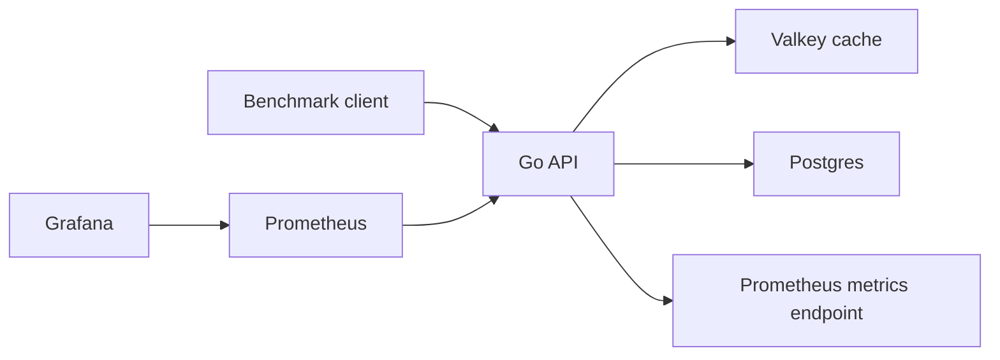
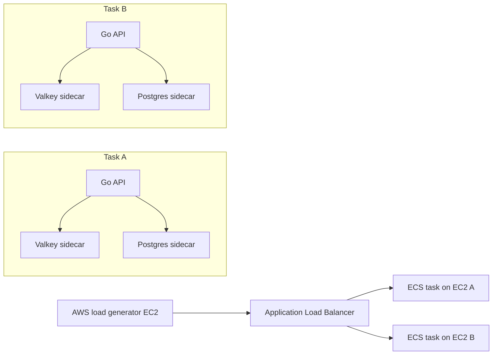
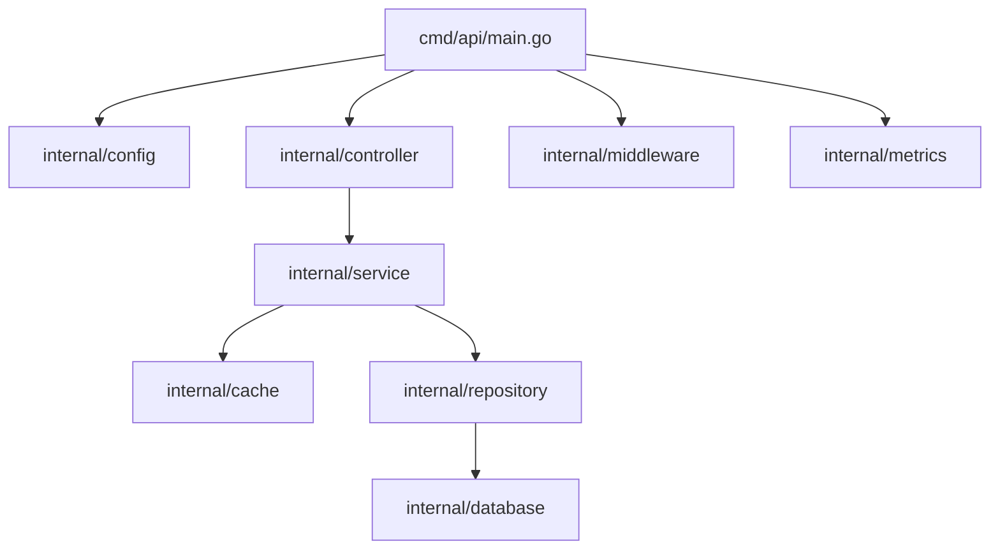
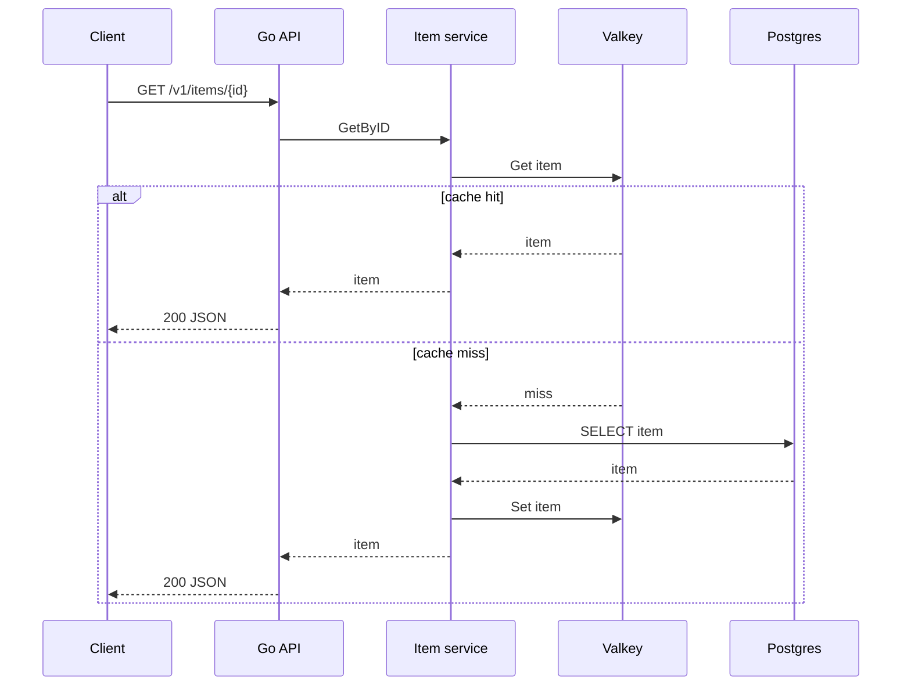
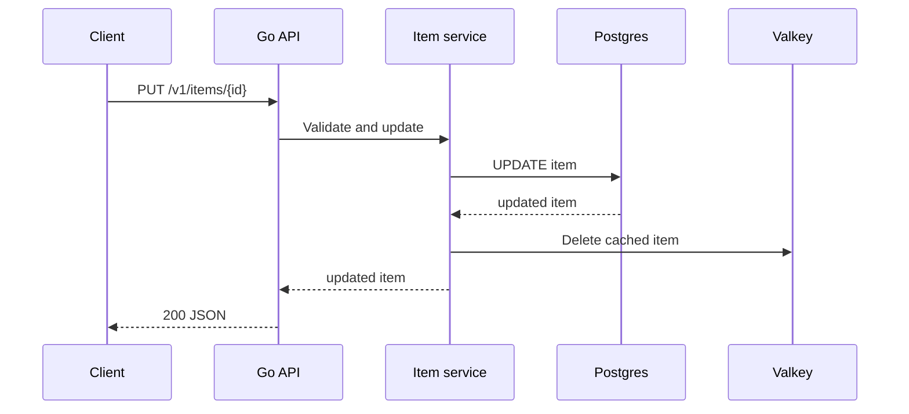

# Architecture

This project is a layered Go API designed for high-read traffic experiments.

The architecture is intentionally simple at the application layer and progressively more realistic at the infrastructure layer.

## Local Architecture

Local Docker Compose services:

- `api`
- `postgres`
- `redis` using Valkey
- `prometheus`
- `grafana`

## AWS Learning Architecture

The final AWS learning shape used two ECS tasks behind an Application Load Balancer.

This was chosen for learning and cost control. It is not the final architecture for very high RPS production systems.

## Application Layers

Layer responsibilities:

- `cmd/api`: application wiring and server lifecycle.
- `internal/config`: environment configuration.
- `internal/controller`: HTTP request parsing and response writing.
- `internal/service`: business flow and cache orchestration.
- `internal/repository`: Postgres queries.
- `internal/cache`: Valkey read/write/delete logic.
- `internal/database`: Postgres pool setup and migrations.
- `internal/middleware`: request logging, request IDs, metrics middleware.
- `internal/metrics`: Prometheus metric definitions and database pool observers.

## Request Path

Normal cached read:

Update path:

## Important Design Decisions

- Use Go standard `net/http` routing.
- Keep packages small and explicit.
- Use `pgxpool` for Postgres pooling.
- Use Valkey for hot-read caching.
- Use Prometheus metrics for visibility during load testing.
- Use Terraform for repeatable AWS infrastructure.
- Keep AWS tests short to control cost.

## Production Gap

The AWS sidecar database/cache pattern is useful for learning but not ideal for production. A production path would normally move Postgres and Valkey to shared managed services or dedicated clusters.
