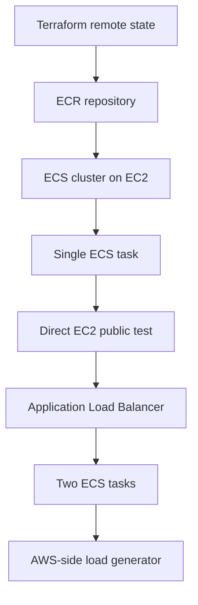
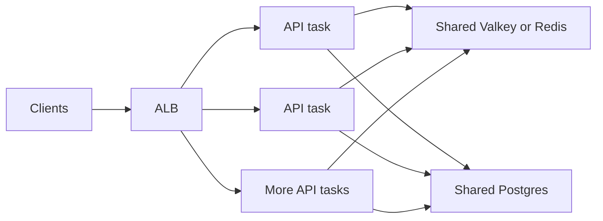

# AWS Deployment

Terraform was used to create AWS infrastructure for learning and benchmarking.

The AWS resources were destroyed after testing to control cost.

## Terraform Layout

```text
terraform/
  global/
    state-backend/
  envs/
    dev/
```

The global state backend originally created:

- S3 bucket for Terraform state
- DynamoDB table for state locking

The dev environment created:

- VPC
- public subnets
- route table
- internet gateway
- security groups
- ECR repository
- ECS cluster
- EC2 capacity provider
- ECS task definition
- ECS service
- Application Load Balancer
- load generator EC2 instance
- IAM roles and instance profiles
- CloudWatch log group

## AWS Evolution



## ECS Task Shape

During the learning phase, each ECS task ran:

```text
Go API
Postgres sidecar
Valkey sidecar
```

This kept the project simple and avoided managed database/cache cost.

## Why Sidecars Were Used

Sidecars helped with:

- fast learning
- lower cost
- simpler teardown
- no RDS or managed cache dependency

They are not the ideal production shape.

## Production Direction

A stronger production-like design would look more like:



## Cost Control Rule

AWS compute and load balancers should not be left running while idle.

Recommended workflow:

```text
create stack -> test for a short window -> record results -> destroy stack
```

## Public-Safe Docs

This repository should not publish:

- live ALB DNS names
- public IPs
- AWS account IDs
- ARNs
- security group IDs
- subnet IDs
- VPC IDs
- real Terraform state bucket names

Use placeholders instead.
