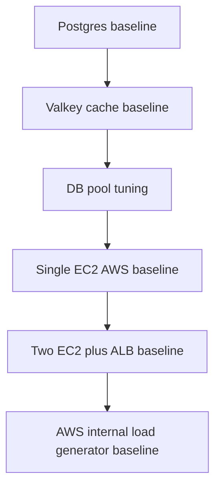

# Benchmarking

This project records benchmark results as part of the learning process.

Benchmark reports live in `benchmark/`.

## Tool

The project uses Bombardier through Docker:

```powershell
docker run --rm alpine/bombardier -c <CONCURRENCY> -d 30s -l <TARGET_URL>
```

The URL is written as a placeholder in docs so live endpoints are not published.

## Why 30 Seconds

A one-second test is too noisy. It can be distorted by:

- connection setup
- CPU scheduling
- Docker networking
- cache warm-up
- short traffic spikes

A 30-second run gives a better sustained signal.

## Key Numbers

Requests per second:

```text
How many requests the system handled each second on average.
```

p50 latency:

```text
50% of requests completed within this time.
```

p95 latency:

```text
95% of requests completed within this time.
```

p99 latency:

```text
99% of requests completed within this time.
```

Errors:

```text
Requests that failed from the benchmark client's point of view.
```

## Local Benchmark Summary

Best local hot-cache result:

```text
Concurrency: 250
Average throughput: about 12.7k requests/sec
p99 latency: about 56ms
Errors: 0
```

## AWS Benchmark Summary

Single EC2 direct endpoint:

```text
Average throughput: about 1.6k requests/sec
Errors: 0
```

Two EC2 tasks behind ALB from laptop:

```text
Average throughput: about 2.8k requests/sec
Errors: 0
```

Two EC2 tasks behind ALB from AWS load generator:

```text
Average throughput: about 3.0k requests/sec
Errors: 0
```

## Why Local Was Faster

Local benchmark path:

```text
local benchmark client -> local Docker network -> API -> local cache/database
```

AWS benchmark path:

```text
AWS load generator -> ALB -> ECS task -> API -> sidecar cache/database
```

Local had less network and infrastructure overhead. AWS provided the path to scale horizontally, but the tested AWS infrastructure was intentionally small.

## Benchmark Progression



## How To Resume Benchmarking

1. Start with a health check.
2. Warm the cache.
3. Run `100` concurrency.
4. Run `250` concurrency.
5. Run `500` concurrency only if there are no errors.
6. Record RPS, p95, p99, errors, and interpretation.
7. Stop AWS resources after the test window.
