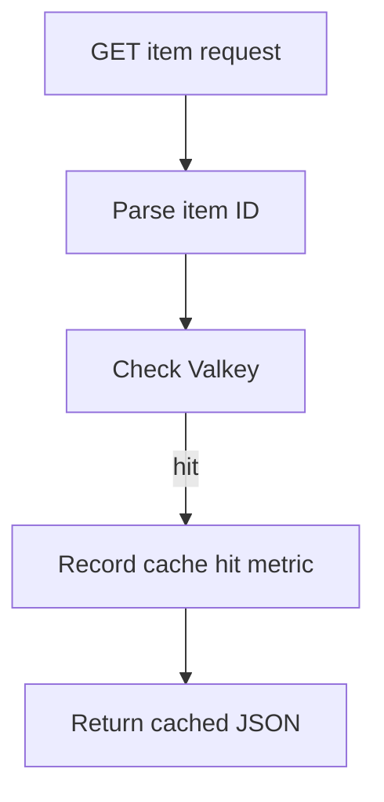
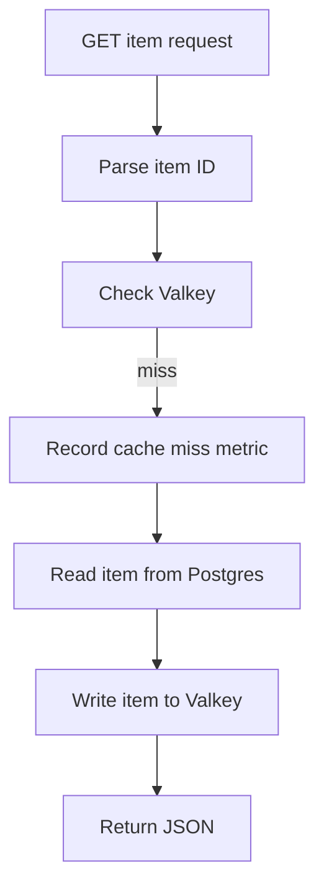
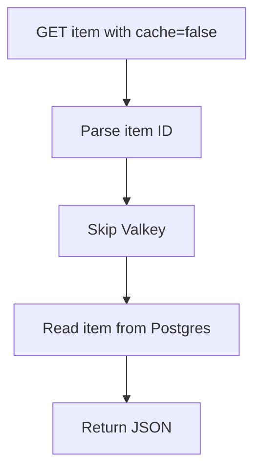
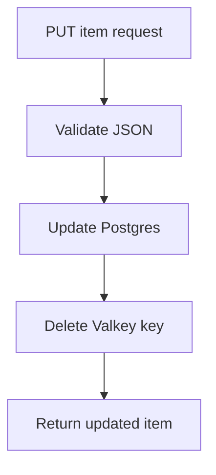

# Data And Cache Flow

The project uses Postgres as the source of truth and Valkey as a hot-read cache.

## Database Schema

The `items` table contains:

```text
id
name
description
price_cents
created_at
```

Local Docker Compose initializes this table from `migrations/001_create_items.sql`.

The Go API also has startup migration logic so cloud sidecar Postgres containers can initialize themselves during the AWS learning deployment.

## Cache Key

Item cache keys use this shape:

```text
items:{id}
```

Example:

```text
items:1
```

## Cache Hit Flow



## Cache Miss Flow



## Cache Bypass Flow



## Update And Invalidation Flow



## Why Cache Invalidation Is Delete-Based

The update path deletes the cache key instead of rewriting it directly.

Reason:

- Postgres remains the source of truth.
- The next read repopulates the cache.
- This keeps update behavior simple and predictable.

## Benchmark Meaning

Normal endpoint:

```text
GET /v1/items/1
```

This mostly measures hot-cache read performance after warm-up.

No-cache endpoint:

```text
GET /v1/items/1?cache=false
```

This measures Postgres and database pool pressure.
