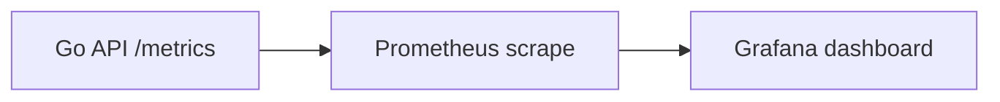

# Observability

The project uses Prometheus and Grafana to make load-test behavior visible.

## Metrics Endpoint

The API exposes:

```text
GET /metrics
```

Prometheus scrapes this endpoint.

## Dashboard Areas

The Grafana dashboard tracks:

- Requests per second
- HTTP latency
- Requests by status
- Server errors
- Goroutines
- Go memory allocation
- Cache hits and misses
- Database pool total connections
- Database pool acquired connections
- Database pool idle connections
- Database wait count
- Database wait duration

## Metrics Flow



## Why Observability Was Added

Raw benchmark output is not enough. A benchmark may show lower RPS, but without metrics it is hard to know why.

Observability helps answer:

- Is the API receiving traffic?
- Are requests failing?
- Is latency rising?
- Is the cache being hit?
- Is Postgres pool waiting increasing?
- Is memory growing?
- Are goroutines climbing?

## Cache Metrics

Cache metrics are useful for proving whether a benchmark is mostly testing:

- hot-cache reads
- cache misses
- cache errors

## Database Pool Metrics

Database pool metrics were added because Postgres can become a bottleneck even when the API process itself is healthy.

Useful signals:

- total connections
- acquired connections
- idle connections
- wait count
- wait duration

High wait count or wait duration means requests are waiting for database connections.
